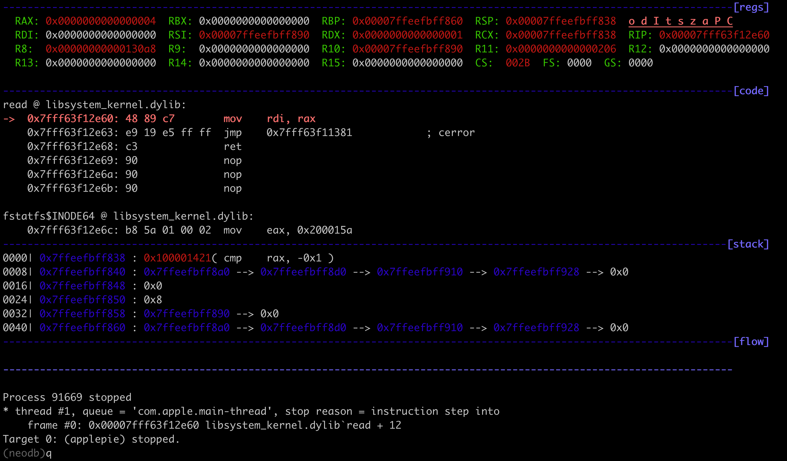

# neodb

A peda like lldbinit file for lldb. Based on https://github.com/gdbinit/lldbinit

## How to install

```
cp lldbinit.py ~
echo "command script import  ~/lldbinit.py" >>~/.lldbinit
```

or

```
cp lldbinit.py /Library/Python/2.7/site-packages
echo "command script import lldbinit" >>~/.lldbinit
```

or

just copy it somewhere and use **command script import path_to_script** when you want to load it.

## How to use

List all implemented commands with 'lldbinitcmds'

## Configuration

There are some user configurable options on the header. You can also use the enable/disable commands to real time configure some options.

## Features


